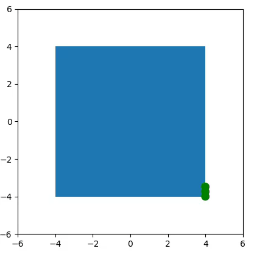
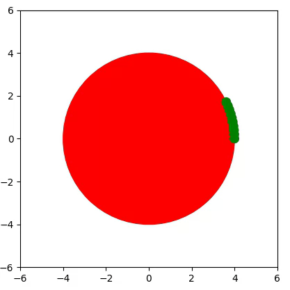

# ODD-RuGS
Optimal Dynamic Distribution of Robots using Graph Search

## Purpose
The goal of this work is to find the optimal distribution of agents (robots) around an object. This can help optimize carrying and transport strategies for collective transport. Here, an optimal distribution is defined as an agent configuration such that the convex hull drawn between them contains the Center of Mass of the object. Any number of agents >2 can be tested. This uses a breadth-first graph search method where each configuration of agents represents a node. Each node is weighted according to its 'goodness' corresponding to the distance of the center of the agents' convex hull to the object's centroid (geometric center).

## Results
For a square object with 3 agents:

And for a circular object with 10 agents:

